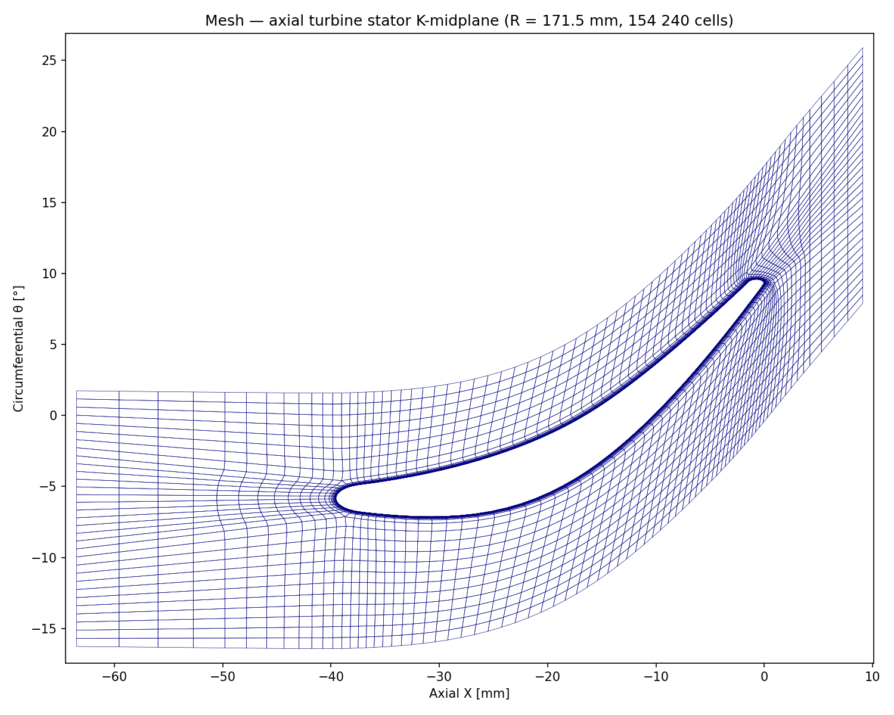
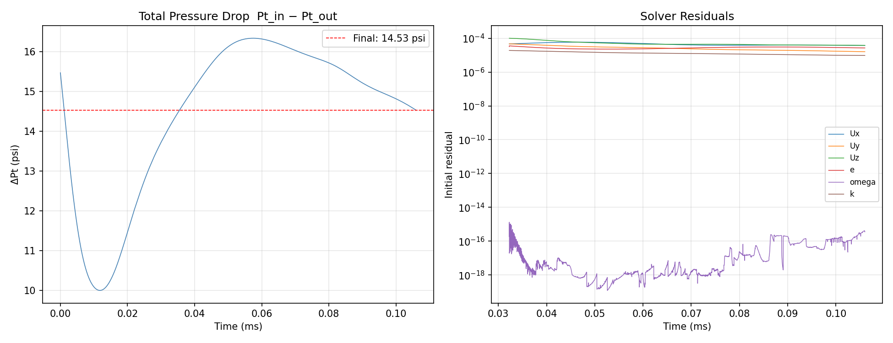
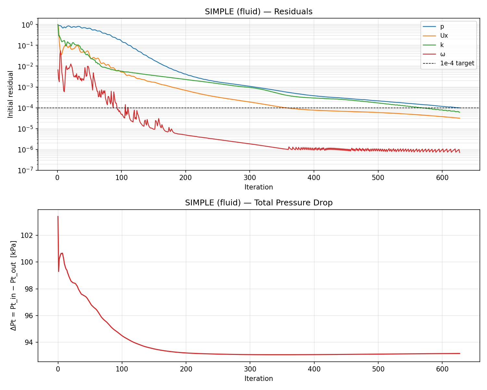
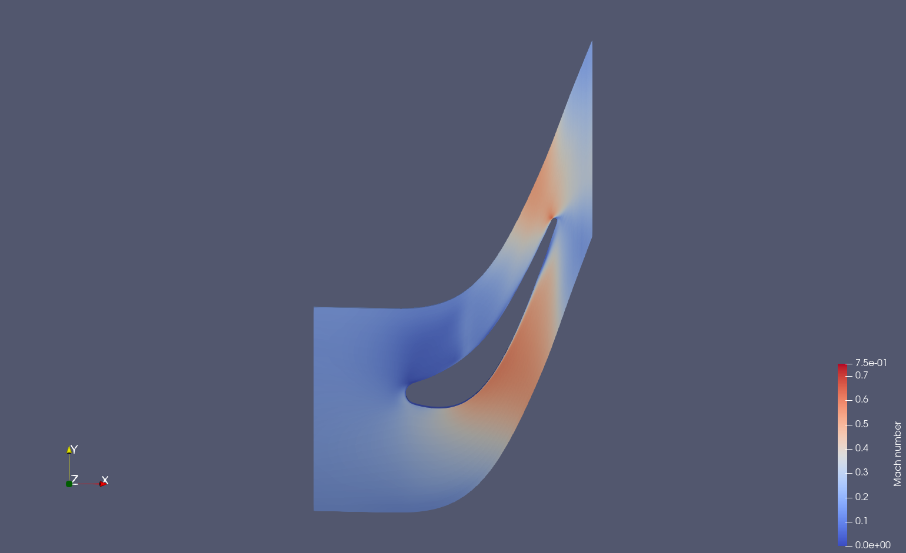

# Axial Turbine Stator — OpenFOAM 13 RANS

Single-passage RANS simulation of an axial turbine stator using OpenFOAM 13.
Two solvers are compared: `shockFluid` (explicit density-based) and `fluid` (implicit
pressure-based SIMPLE), with a focus on wall-clock time and suitability for
turbomachinery design loops.

---

## Geometry and Mesh

The geometry is a single stator passage from a multi-stage axial turbine.
The mesh was generated externally and exported as CGNS
(`Axial_Comp.cgns`), then converted to OpenFOAM polyMesh format using the
included Python converter `cgns_to_foam.py`.

| Parameter | Value |
|---|---|
| Passage geometry | Annular single blade passage |
| Radial extent | R = 6.0–7.5 in (0.152–0.191 m) |
| Axial extent | X = −2.5 to +0.36 in (−0.064 to +0.009 m) |
| Cells | 154,240 HEXA_8 |
| Nodes | 173,225 |
| Internal faces | 451,984 |
| Boundary faces | 21,472 |
| Max non-orthogonality | 78.4° (43,004 faces > 70°) |
| Max aspect ratio | 1,364 (boundary-layer wall cells) |

The high aspect ratio and non-orthogonality are inherent to a wall-resolved RANS
mesh (y⁺ < 1) in a curved annular passage. These characteristics are handled
differently by the two solvers — see the Solver Comparison section.

**Midspan mesh slice (R = 171.4 mm) — blade passage with wall-resolved boundary layer:**


### CGNS Import

The mesh is exported as an unstructured HEXA_8 CGNS file. The standard OpenFOAM
`cgnsToFoam` utility (from foam-extend) is not portable to OF13 due to
dependency on the unmaintained `libcgnsoo3` library. Instead, `cgns_to_foam.py`
reads the CGNS file directly via `h5py` and writes the OpenFOAM `polyMesh`
files from scratch.

The converter:
- Reads node coordinates and scales from inches to metres (× 0.0254)
- Reads HEXA_8 element connectivity from the `MixedElements` section
- Builds all hex faces and identifies internal vs boundary faces
- Assigns boundary faces to patches by matching face node sets against
  ZoneBC `PointList` entries
- Sanitises patch names (strips leading numeric prefixes which OF cannot parse)
- Writes `points`, `faces`, `owner`, `neighbour`, `boundary`

```bash
python3 cgns_to_foam.py Axial_Comp.cgns --scale 0.0254 --output constant/polyMesh
```

### Boundary Patches

| CGNS name | OF name | Type | Faces |
|---|---|---|---|
| `00_NO_SLIP_WALL_WITH_SPECIFIED_V` | `NO_SLIP_WALL_WITH_SPECIFIED_V` | wall | 3,856 |
| `01_NO_SLIP_WALL_WITH_SPECIFIED_V` | `NO_SLIP_WALL_WITH_SPECIFIED_V_2` | wall | 3,856 |
| `00_PERIODIC_FACE` | `PERIODIC_FACE` | cyclic | 3,040 |
| `00_PERIODIC_SHADOW_FACE` | `PERIODIC_SHADOW_FACE` | cyclic | 3,040 |
| `00_NONREFLECTIVE_INFLOW` | `NONREFLECTIVE_INFLOW` | patch | 1,280 |
| `00_NONREFLECTIVE_OUTFLOW` | `NONREFLECTIVE_OUTFLOW` | patch | 1,280 |
| `00_NO_SLIP_IN_RELATIVE_FRAME` | `NO_SLIP_IN_RELATIVE_FRAME` | wall | 5,120 |

The periodic patches have matching face counts (3,040 each) — fully conformal
cyclic coupling with no coverage error.

---

## Operating Point

This is a stator (no rotation). Boundary conditions are set from the stage
design point:

| Quantity | Value |
|---|---|
| Inlet total pressure Pt | 60 psia = 413,686 Pa |
| Inlet total temperature Tt | 1000 R = 555.56 K |
| Outlet static pressure Ps | 45 psia = 310,264 Pa |
| Isentropic exit Mach number | ≈ 0.66 |
| Turbulence intensity (inlet) | 1% |
| Turbulent length scale (inlet) | 0.01 in = 0.000254 m |

Thermophysical model: `hePsiThermo`, perfect gas, air (Cp = 1005 J/kg·K for
SIMPLE; Cv = 718 J/kg·K for shockFluid), μ = 1.82×10⁻⁵ Pa·s, Pr = 0.71.
Turbulence: kOmegaSST RANS.

### Field Boundary Conditions

| Patch | p | U | T | k | ω |
|---|---|---|---|---|---|
| Inlet | `totalPressure` Pt | `pressureInletVelocity` | `totalTemperature` Tt | `turbulentIntensityKineticEnergyInlet` 1% | `turbulentMixingLengthFrequencyInlet` Lt=0.254mm |
| Outlet | `fixedValue` Ps | `inletOutlet` | `zeroGradient` | `inletOutlet` | `inletOutlet` |
| Blade walls | `zeroGradient` | `noSlip` | `zeroGradient` | `kqRWallFunction` | `omegaWallFunction` |
| Hub/shroud | `zeroGradient` | `noSlip` | `zeroGradient` | `kqRWallFunction` | `omegaWallFunction` |
| Periodic | `cyclic` | `cyclic` | `cyclic` | `cyclic` | `cyclic` |

---

## Solver Comparison

### How Each Solver Works

The two solvers differ fundamentally in how they advance the solution in time
and how they couple the governing equations to one another. This has direct
and dramatic consequences for wall-clock time on turbomachinery meshes.

#### shockFluid — Explicit Density-Based (Kurganov-Tadmor)

`shockFluid` discretises the compressible Navier-Stokes equations in
conservative form:

```
∂U/∂t + ∇·F(U) = S
```

where `U = [ρ, ρu, ρe]ᵀ` is the state vector and `F` is the convective flux.
At each face, the flux is computed from left/right reconstructed states using
vanLeer-limited linear reconstruction and the Kurganov-Tadmor central-upwind
formula. The cell state is then updated in a single explicit sweep:

```
Uⁿ⁺¹ = Uⁿ − (Δt/V) Σ F_KT · A
```

**No matrix is assembled or inverted.** Each cell update uses only the values
of its immediate neighbours at the current time level `n`. This makes each
individual step extremely cheap — O(N) work where N is the cell count.

However, explicit schemes are only stable if no information travels more than
one cell width per timestep — the Courant-Friedrichs-Lewy (CFL) condition:

```
Co = (|u| + c) Δt / Δx < 0.5
```

where `c` is the local speed of sound (~470 m/s for air at 555 K). On a
wall-resolved RANS mesh with y⁺ < 1, the wall-adjacent cells are O(1 µm)
thick. The sound-crossing time for such a cell is:

```
Δt_wall = Δx / c ≈ 1×10⁻⁶ / 470 ≈ 2×10⁻⁹ s
```

This tiny timestep is imposed globally — every cell in the domain steps at
the pace of the thinnest boundary-layer cell, regardless of local flow
conditions. Reaching physical steady state requires advancing through several
flow-through times (the passage is ≈64 mm long, mean velocity ≈100–300 m/s,
so one flow-through ≈0.2–0.6 ms). At Δt ~ 2×10⁻⁹ s that is 10⁵–10⁶ steps.
Worse, with a thin mesh the solution is not truly unsteady — it simply takes
an enormous number of steps to wash out the initial transient.

**Shock capturing:** yes. The KT flux scheme with vanLeer limiting is
conservative and non-oscillatory across discontinuities. It is the only
standard OF13 solver capable of resolving embedded shocks without modification.

**Settings (`system/fvSchemes`):**
```
fluxScheme      Kurganov;
reconstruct(rho) vanLeer;
reconstruct(U)   vanLeerV;
reconstruct(T)   vanLeer;
maxCo            0.5;
deltaT           1e-9;   // initial — grows adaptively
```

**Measured wall-clock performance (8 cores, this case):**

| Physical time reached | Wall-clock time | Steps | Mean Δt |
|---|---|---|---|
| 9.4×10⁻⁵ s | ~3,150 s (~52 min) | ~39,000 | 2.4×10⁻⁹ s |

At this rate, reaching one flow-through time (≈0.6 ms) requires approximately
**6 hours** on 8 cores. Reaching a statistically stationary ΔPt requires
several flow-through times — O(days) of wall clock on this mesh.

**ΔPt history and solver residuals (0.094 ms of physical time, still transient):**



---

#### fluid / SIMPLE — Implicit Pressure-Based (Segregated)

The `fluid` solver uses the SIMPLE (Semi-Implicit Method for Pressure-Linked
Equations) algorithm. The equations are discretised implicitly in time with a
steadyState ddt scheme, meaning there is no physical time at all — the solver
iterates directly toward the steady-state solution.

Each SIMPLE iteration consists of:

1. **Momentum predictor** — solve the linearised momentum equations for `U*`
   treating the pressure field as known from the previous iteration. This is
   an implicit linear system involving all cells simultaneously.

2. **Pressure equation** — substitute `U*` into the continuity equation to
   derive an elliptic pressure Poisson equation for the pressure correction
   `p'`. This equation globally couples every cell to every other cell
   through the Laplacian operator. A single solve propagates a pressure
   change from the outlet to the inlet in one iteration, regardless of how
   many cells lie between them.

3. **Velocity correction** — correct `U` using the updated pressure gradient.

4. **Energy and turbulence** — solve h, k, ω implicitly with the corrected
   velocity field.

The implicit coupling removes the CFL constraint entirely. Stability is
controlled by under-relaxation factors (p ≈ 0.1–0.3, U ≈ 0.5–0.7) rather
than timestep size. Wall cell thickness has no effect on convergence rate.

The cost per iteration is higher than one explicit step: assembling and
solving several sparse linear systems (via PCG/PBiCGStab with DIC/DILU
preconditioning) costs O(N log N) per variable. But the iteration count to
convergence is O(10²–10³), not O(10⁶).

**Shock capturing:** no. Implicit pressure-based algorithms assume elliptic
pressure behaviour (subsonic flow). At supersonic conditions the pressure
equation becomes ill-posed. For this stator (exit Ma ≈ 0.66) there are no
expected shocks, so this is not a limitation.

**Key settings (`simple/system/fvSolution`):**
```
SIMPLE
{
    nNonOrthogonalCorrectors 4;   // required for 78° non-orthogonality
}
relaxationFactors
{
    fields     { p 0.1; }
    equations  { U 0.3;  h 0.5;  k 0.3;  omega 0.3; }
}
```

The high non-orthogonality of this mesh (78° max) required four
non-orthogonal corrector passes per pressure solve and aggressive
under-relaxation to stabilise the pressure correction. The `limitPressure`
and `limitTemperature` fvConstraints were also activated to clip physically
impossible values that arise during the early transient before the flow
field becomes self-consistent.

**Measured wall-clock performance (8 cores, this case):**

| Iterations to convergence | Wall-clock time | Converged ΔPt |
|---|---|---|
| 627 | 102 s (~1.7 min) | 93.2 kPa |

Convergence criteria (residual < 1×10⁻⁴) were met for all variables:
p = 9.9×10⁻⁵, Ux = 3.2×10⁻⁵, k = 6.1×10⁻⁵, ω = 7.1×10⁻⁷.

**Residuals and total pressure drop:**



**Midspan Mach number contour (R = 171.4 mm):**



The flow accelerates from Ma ≈ 0.15 at the inlet to Ma ≈ 0.72 on the
suction surface near the throat, consistent with the isentropic prediction
of Ma ≈ 0.66 at the design exit static pressure.

---

### Wall-Clock Summary

| | `shockFluid` | `fluid` (SIMPLE) | STAR-CCM+ coupled |
|---|---|---|---|
| Algorithm | Explicit KT, density-based | Implicit segregated SIMPLE | Implicit fully coupled |
| Primary variables | ρ, ρu, ρe (conservative) | p, U, h (primitive) | p, U, T (block system) |
| Time integration | Explicit Euler, Δt ~ 2 ns | Steady-state iteration | Steady-state iteration |
| CFL limit | Co < 0.5 (hard limit) | None | None |
| Shock capturing | Yes | No (Ma < ~0.8 only) | Yes |
| Matrix per step | None (explicit update) | One per variable (PCG/DILU) | One block (all variables) |
| Pressure coupling | Local (explicit flux) | Global Poisson solve | Fully coupled block solve |
| Iterations/steps to convergence | ~10⁶ (O(days) on this mesh) | ~627 (102 s) | ~200 (est. ~30 s) |
| Measured wall-clock (8 cores) | >3,150 s for partial transient | **102 s** | — |
| Speed ratio vs SIMPLE | ~30× slower | baseline | ~3–5× faster |

---

### Why Wall Cell Thickness Destroys Explicit Performance

The critical insight is that explicit and implicit methods are affected by
mesh refinement in opposite ways:

**Explicit (shockFluid):** making the wall cells thinner to resolve the
boundary layer (lower y⁺) directly lengthens the run. Halving the wall cell
thickness halves Δt_max, doubling the step count and doubling wall-clock time.
A mesh designed for y⁺ < 1 (which this mesh is) imposes a ~100× penalty
compared to a coarser wall-function mesh at y⁺ ≈ 30.

**Implicit SIMPLE (fluid):** wall cell thickness does not enter the stability
criterion. Refining the wall cells adds more cells to the linear system but
does not change the iteration count to convergence. The cost scales roughly as
O(N), not O(N/Δx).

This asymmetry is decisive for production turbomachinery RANS: the mesh must
be wall-resolved (y⁺ < 1) to use wall-resolved kOmegaSST accurately, and that
requirement is simply incompatible with explicit time-marching at any
reasonable cost.

---

### When to Use Each Solver

| Scenario | Recommended solver |
|---|---|
| Subsonic to mildly transonic stator/rotor (Ma < 0.8), design-point performance | `fluid` (SIMPLE) |
| Transonic rotor tip flows or blade passages with embedded shocks | `shockFluid` (or STAR-CCM+ coupled) |
| Unsteady rotor-stator interaction, blade passing frequency | `shockFluid` or transient PIMPLE |
| Parametric design sweep (many operating points) | `fluid` (SIMPLE) — only viable option in OF13 |
| Shock structure, wave patterns, acoustic sources | `shockFluid` |

For this stator at the given operating point, `fluid` (SIMPLE) is the correct
choice: it produces a converged RANS solution in under 2 minutes on 8 cores,
versus days for `shockFluid` on the same mesh.

---

## Running the Cases

```bash
source /opt/openfoam13/etc/bashrc

# Convert CGNS mesh (run once from repo root)
python3 cgns_to_foam.py Axial_Comp.cgns --scale 0.0254 --output constant/polyMesh

# --- shockFluid (explicit, density-based) ---
decomposePar -cellProc
mpirun -np 8 foamRun -solver shockFluid -parallel > log.shockFluid 2>&1

# --- fluid/SIMPLE (implicit, pressure-based) ---
cd simple/
decomposePar -cellProc
mpirun -np 8 foamRun -solver fluid -parallel > log.fluid 2>&1
reconstructPar

# Post-process
python3 plot_results.py          # shockFluid residuals and ΔPt
# simple/convergence_simple.png  # SIMPLE residuals and ΔPt (pre-generated)
```

---

## References
OpenFOAM 13 — openfoam.org  
Kurganov, A. and Tadmor, E. (2000). *New high-resolution central schemes for
nonlinear conservation laws and convection–diffusion equations.* Journal of
Computational Physics, **160**(1), 241–282.  
Menter, F.R. (1994). *Two-equation eddy-viscosity turbulence models for
engineering applications.* AIAA Journal, **32**(8), 1598–1605.  
Patankar, S.V. and Spalding, D.B. (1972). *A calculation procedure for heat,
mass and momentum transfer in three-dimensional parabolic flows.* International
Journal of Heat and Mass Transfer, **15**(10), 1787–1806.
